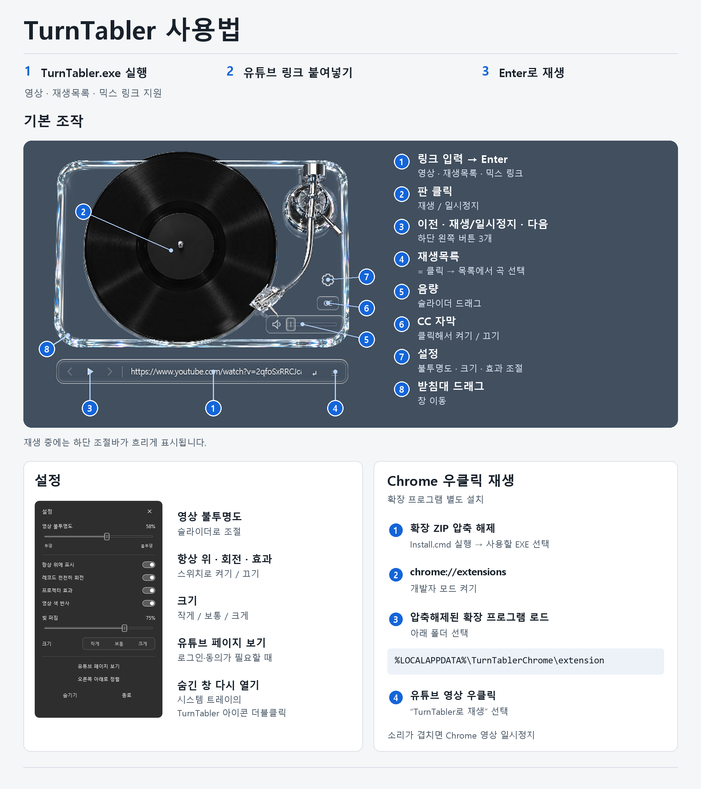
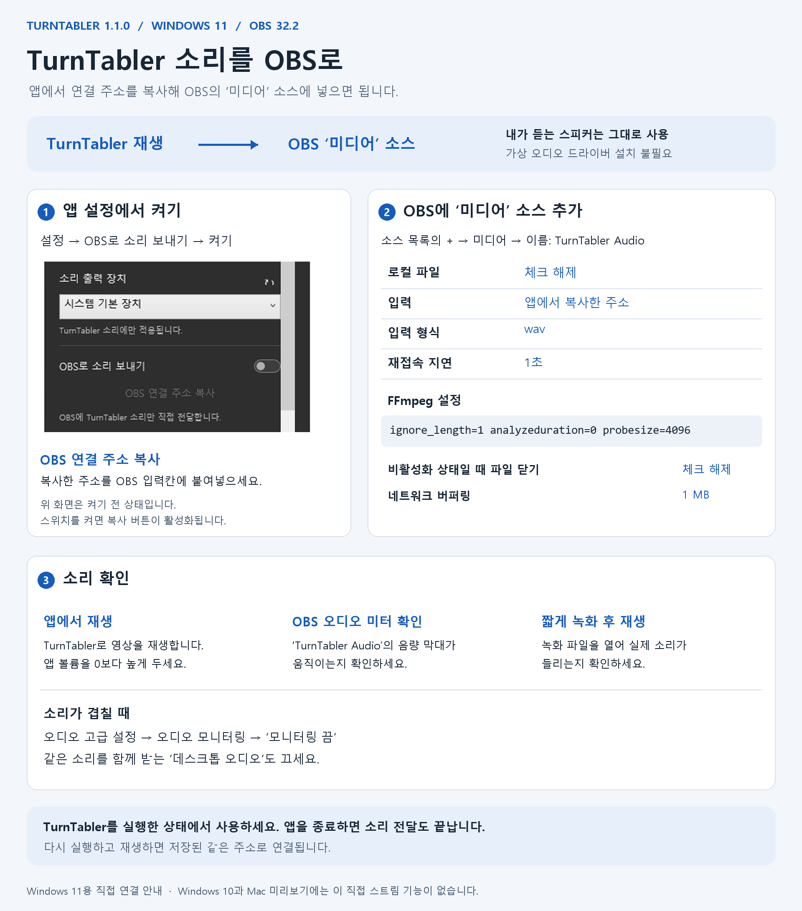

# TurnTabler

원본 출처만 적어놔주시면 수정해서 배포하셔도 잇키마쇼

투명한 네이티브 턴테이블 위젯입니다. Windows 버전은 C# WPF·WebView2, Mac 미리보기 버전은 Swift AppKit·WebKit으로 유튜브의 원래 재생 페이지를 엽니다. Electron과 Node.js는 실행에 필요하지 않습니다.

## 실행

[1.1.0 배포](https://github.com/kmu9842/TurnTabler/releases/tag/v1.1.0)에서 **TurnTabler.exe**를 내려받아 실행하세요. 이미지와 재생 스크립트, .NET 런타임은 EXE에 포함됩니다.

다운로드 파일은 다음과 같습니다.

- `TurnTabler.exe` — Windows 실행 파일
- `TurnTabler-Chrome-1.1.0.zip` — Windows에서 선택 설치하는 Chrome 확장 프로그램
- [TurnTabler-macOS-1.1.1-universal.zip](https://github.com/kmu9842/TurnTabler/releases/download/v1.1.1-macos/TurnTabler-macOS-1.1.1-universal.zip) — Mac 미리보기 앱과 Chrome 연결 도구
- `TurnTabler-guide-ko.png` — 1.1.0 변경점과 사용법 이미지
- `TurnTabler-OBS-guide-ko.png` — OBS 직접 오디오 연결 가이드 이미지

[변경점 가이드 원본 받기](https://github.com/kmu9842/TurnTabler/releases/download/v1.1.0/TurnTabler-guide-ko.png) · [OBS 연결 가이드 원본 받기](https://github.com/kmu9842/TurnTabler/releases/download/v1.1.0/TurnTabler-OBS-guide-ko.png)

Windows 10 2004 이상 / Windows 11의 x64 환경을 지원합니다. 영상은 Windows의 Microsoft Edge WebView2 Runtime을 사용합니다. WebView2가 없는 PC에는 [Microsoft 공식 런타임](https://developer.microsoft.com/microsoft-edge/webview2/)을 설치해야 합니다. 별도의 .NET 설치는 필요하지 않습니다.

소스에서 개발용으로 실행하려면 `Start-TurnTabler.cmd` 또는 `npm.cmd start`를 사용합니다.

## Mac 미리보기 버전

[Mac 1.1.1 배포](https://github.com/kmu9842/TurnTabler/releases/tag/v1.1.1-macos)는 맥 전용 수정본입니다. Windows 앱과 Chrome 확장은 기존 1.1.0을 사용합니다.

macOS 15.4 이상에서 Apple Silicon과 Intel을 지원합니다. ZIP을 풀어 `TurnTabler.app`을 Applications에 옮깁니다. Apple Developer ID 서명·공증이 없는 미리보기 배포본이므로 최초 실행 시 macOS의 개인정보 보호 및 보안 설정에서 실행 허용이 필요할 수 있습니다.

재생·재생목록·이전 곡 기록·광고 스킵 버튼 자동 클릭·자막·브라우저·로그인 저장·출력 스피커 선택·Chrome 링크 전달을 제공합니다. Windows와 같은 960×540 영상 배율과 원형 마스크, 유리 조작부, CC 밑줄, 재생 중 조작부 10% 불투명도를 적용합니다. 설정에서 영상 불투명도, 항상 위 표시, 회전, 프로젝터 효과, 영상 색 반사, 빛 퍼짐, 크기 3단계와 숨기기를 조정할 수 있습니다. Mac WebKit에서 출력 장치 목록을 가져오려면 사용자가 설정의 **출력 장치 목록 허용**을 눌러 마이크 권한을 허용해야 합니다. 마이크 트랙은 즉시 해제하며 녹음하지 않습니다. Chrome 연결은 패키지의 `Install-Chrome.command`로 등록합니다.

Windows용 OBS 직접 스트림은 Mac 미리보기에 포함하지 않았습니다. 이번 Mac 수정본은 Apple Silicon·Intel Universal 빌드를 확인했으며, 실행 테스트는 수행하지 않았습니다. 실제 Mac에서 YouTube 로그인·장시간 재생·하드웨어 오디오·OBS 캡처는 아직 검증하지 못했습니다. 자세한 설치 안내는 [Mac 안내](macos/README-Mac.txt)를 참고하세요.

소스에서는 `bash macos/build.sh`로 `release/macos/TurnTabler.app`과 Universal ZIP을 만듭니다. Windows와 동일한 원본 이미지에서 Mac 빌드 중 레이어를 생성하므로 별도의 이미지 추출 파일이 필요하지 않습니다. 맥 전용 재생 스크립트는 `macos/YouTubeBridge.js`이며 Windows의 재생 스크립트와 분리되어 있습니다. 빌드만 실행하며, URL 자체 검사를 함께 실행하려면 `RUN_SELF_TESTS=1 bash macos/build.sh`를 명시합니다.

## Windows 사용

- 아래 입력칸에 유튜브 영상 또는 재생목록 링크를 붙여 넣고 Enter를 누릅니다. `RD…` 믹스 링크도 선택한 영상과 목록을 함께 유지합니다.
- 영상은 수평을 유지하며 레코드판 전체에 투사됩니다. 홈과 표면 무늬는 24초에 한 바퀴씩 천천히 회전하고, 부드러운 조명 반사는 고정됩니다. 일시정지하면 판이 멈춥니다.
- 영상 중심과 레코드 중심은 일치하며, 영상의 색은 받침대 윤곽에서 약 4px 안쪽에만 부드럽게 퍼집니다.
- 판이나 ▶ 버튼으로 재생/일시정지합니다. ‹ / › 버튼은 이전·다음 곡, 받침대 오른쪽 아래 슬라이더는 음량입니다.
- 음량 위의 작은 **CC** 버튼으로 유튜브 자막을 켜거나 끕니다. 흰색 밑줄은 켜짐 상태이며 곡을 바꾸거나 앱을 다시 실행해도 설정을 유지합니다. 볼륨·CC·재생바는 무색 투명 유리 테마입니다. 영상 자체에 새겨진 가사는 CC로 지울 수 없습니다.
- 주소창 오른쪽 **≡** 버튼으로 재생목록을 열어 곡을 직접 고를 수 있습니다. 곡이 끝나면 유튜브 재생목록 순서대로 다음 곡을 재생합니다.
- 톤암은 바늘 끝이 판 바깥쪽 홈에 살짝 걸치도록 배치했습니다. 주소창과 재생 버튼은 투명한 유리 테마로 묶고 받침대 아래에 여유를 두었습니다. 재생 중 조절바의 불투명도는 10%이며 하단 곡 제목은 표시하지 않습니다. 재생 안내는 조작부 바로 아래 표시됩니다.
- 받침대를 드래그해 이동합니다. CC 위의 설정 버튼과 트레이 우클릭의 **설정**은 같은 창을 엽니다. 무채색 유리 테마의 통합 설정에서 영상 불투명도, 항상 위 표시, 회전, 프로젝터 효과, 영상 색 반사, 빛 퍼짐 강도, 크기를 조정할 수 있습니다.
- 설정 바로 위 **브라우저 버튼**은 같은 창을 확장해 실제 YouTube 페이지를 엽니다. 로그인·검색·재생목록을 마우스와 키보드로 조작하고, 상단 ‘위젯으로 돌아가기’나 ×로 복귀합니다. 로그인 팝업도 같은 앱 세션으로 열립니다.
- 앱 브라우저는 평소 쓰는 Chrome과 별도 프로필입니다. Chrome 확장은 링크만 전달하며 Chrome의 로그인·확장 프로그램·광고 차단 설정은 가져오지 않습니다. 앱에서 로그인하면 `%LOCALAPPDATA%/TurnTablerNative/WebView2`에 유지됩니다. YouTube의 로그아웃·세션 만료·재인증 요구까지 막는 것은 아닙니다.
- 광고의 활성화된 스킵 버튼이 나타나면 자동 클릭합니다. 실패하면 재시도하고 실제 브라우저 입력으로 한 번 더 누릅니다. 스킵 불가능한 광고를 제거하거나 모든 광고를 차단하는 기능은 아닙니다.
- 재생목록·믹스가 곡 종료 후 멈추면 다음 곡 API → 플레이어 버튼 → 같은 목록의 확인된 다음 URL 순으로 복구합니다. 중복 요청을 합치고, 사용자가 멈춘 재생이나 목록 밖 추천 영상에는 자동 전환하지 않습니다.
- 설정의 **소리 출력 장치**에서 스피커·헤드폰·모니터 오디오를 선택합니다. TurnTabler 재생에만 적용되고 선택은 저장됩니다. 장치를 분리하면 시스템 기본 장치로 돌아갑니다. ↻로 목록을 새로고침할 수 있습니다.
- ‘숨기기’ 후에는 시스템 트레이의 TurnTabler 아이콘을 더블클릭해 다시 표시합니다.
- 레코드 위 영상의 기본 불투명도는 **58%**입니다. 통합 설정에서 0~100%로 조절할 수 있으며, 변경 즉시 반영되고 재실행 후에도 유지됩니다.

설정과 마지막 링크는 `%LOCALAPPDATA%/TurnTablerNative`에 저장됩니다. 평소 실행 시 마지막 링크를 자동 재생하지 않습니다.

## OBS 소리 연결 (Windows 11)

설정에서 **OBS로 소리 보내기**를 켠 뒤 **OBS 연결 주소 복사**를 누릅니다. OBS의 미디어 소스에서 ‘로컬 파일’을 해제하고 입력에 붙여넣습니다. 입력 형식은 `wav`, FFmpeg 옵션은 `ignore_length=1 analyzeduration=0 probesize=4096`입니다. 소스가 비활성일 때 파일을 닫는 옵션은 끄고 재연결 지연은 1초로 두면 앱 재실행 후에도 같은 소스로 다시 연결됩니다.

앱이 자신의 WebView2 브라우저 프로세스를 Windows 프로세스 루프백으로 캡처해, 로컬 컴퓨터에서만 접근 가능한 PCM 스트림을 OBS에 전달합니다. 스피커 변경·가상 오디오 드라이버·전체 데스크톱 캡처는 필요하지 않습니다. 앱 볼륨과 일시정지가 OBS에도 반영됩니다. 연결 주소는 해당 PC의 설정에 저장되며 타인에게 공유할 필요가 없습니다.

OBS의 오디오 모니터링은 ‘모니터링 끄기’로 둡니다. 앱 자체에서 이미 소리를 듣기 때문에 OBS 모니터링까지 켜면 소리가 겹칩니다. 이 소스를 사용하면서 데스크톱 오디오도 함께 녹음하면 중복될 수 있으므로 방송 장면에서는 데스크톱 오디오를 끄세요. Windows 10에서는 이 직접 연결 옵션을 제공하지 않으며 일반 재생과 출력 장치 선택은 사용할 수 있습니다.

`node scripts/test-obs.mjs`는 설치된 OBS의 별도 TurnTabler 장면에서 테스트 음원 → 6초 정지 → 재개를 녹음하고, 녹음 파일을 디코딩하여 실제 음량을 검증합니다. Node.js와 테스트용 FFmpeg(`FFMPEG` 환경 변수 또는 Python `imageio_ffmpeg`)가 필요합니다. 브라우저 마우스·키보드와 출력 장치 저장 검증은 `TurnTabler.exe --interaction-smoke`, 재생/광고 복구 단위 검증은 `npm run test:chrome`으로 실행합니다.

## Chrome에서 우클릭으로 재생

**TurnTabler 1.1.0**은 기존 **TurnTabler-Chrome-1.0.0.zip**과 호환됩니다. EXE만 실행하면 브라우저 확장은 설치되지 않습니다.

1. `TurnTabler.exe`를 사용할 폴더에 저장합니다.
2. 확장 ZIP을 풀고 `Install.cmd`를 실행해 사용할 EXE를 선택합니다. 관리자 권한은 필요하지 않습니다.
3. Chrome의 `chrome://extensions`에서 **개발자 모드 → 압축해제된 확장 프로그램을 로드합니다**를 선택합니다.
4. 설치 안내에서 복사한 `%LOCALAPPDATA%\TurnTablerChrome\extension` 폴더를 선택합니다.
5. 영상 위에서 한 번 우클릭하면 **유튜브 자체 메뉴 맨 위**에 **TurnTabler로 재생**이 표시됩니다. 썸네일 링크·페이지 빈 공간에서는 Chrome 기본 우클릭 메뉴를 사용합니다.

앱이 꺼져 있으면 자동 실행하며, 실행 중이면 같은 위젯에서 곡을 바꾸고 숨겨진 위젯을 다시 표시합니다. 재생목록·믹스와 링크의 시작 시간을 유지합니다. 브라우저에서 이미 재생하던 영상은 필요하면 직접 일시정지하세요. 툴바 아이콘을 누르면 앱 연결 상태를 확인할 수 있습니다.

EXE 위치를 옮겼다면 확장 아이콘의 **설정 · 앱 경로 변경**에서 파일을 선택하거나 경로를 입력해 저장합니다. 현재 경로와 실제 파일 버전이 표시되며, 기존 EXE가 없어도 다시 지정할 수 있습니다. 설치기는 앱 실행 없이 파일 정보와 최소 버전을 확인합니다. 제거할 때는 `Uninstall.cmd` 실행 후 Chrome에서 확장을 제거합니다. 앱과 기존 설정은 유지됩니다. 웹 스토어에 게시하지 않은 로컬 설치용 확장이며, 자세한 안내는 [확장 설치 안내](chrome-extension/README.txt)에 있습니다.

확장 업데이트 후에는 `chrome://extensions`에서 확장의 **새로고침**을 누르고 **유튜브 탭도 새로고침**하세요. 자체 메뉴 항목은 유튜브 사이트에만 적용되는 콘텐츠 스크립트로 추가합니다. 유튜브의 메뉴 구조가 바뀌면 확장 업데이트가 필요할 수 있으며, Chrome 기본 메뉴에서도 계속 재생할 수 있습니다.

연결은 Chrome의 [Native Messaging](https://developer.chrome.com/docs/extensions/develop/concepts/native-messaging)을 사용합니다. 확장 패키지에 포함된 작은 연결 프로그램이 요청할 때만 실행됩니다. 기존 배포본에는 Windows UI Automation으로 링크 입력과 재생을 전달하고, 연결 기능이 추가된 빌드에는 현재 사용자 전용 파이프를 사용합니다. 설정은 `%LOCALAPPDATA%\TurnTablerChrome\host\settings.json`에 저장합니다. 확장 아이콘은 EXE의 ICO에서 같은 PNG 프레임을 추출해 사용합니다.
